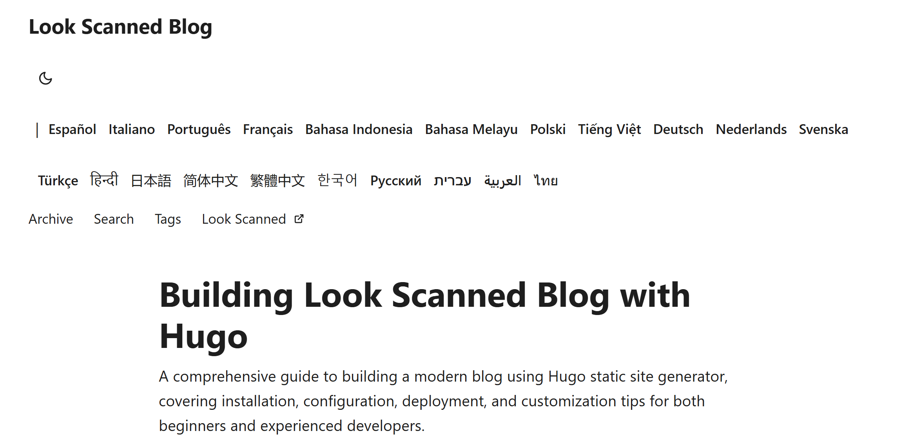

+++
date = '2025-01-17T21:11:58+08:00'
draft = false
title = 'Hugo PaperMod के लिए सुविधाजनक भाषा चयनकर्ता का निर्माण'
summary = 'Hugo PaperMod में एक ड्रॉपडाउन मेनू वाला भाषा चयनकर्ता बनाने का विस्तृत मार्गदर्शन, जो बहुभाषी वेबसाइटों पर नेविगेशन को सरल और सहज बनाता है'
description = 'Hugo PaperMod में एक ड्रॉपडाउन मेनू वाला भाषा चयनकर्ता बनाने का विस्तृत मार्गदर्शन, जो बहुभाषी वेबसाइटों पर नेविगेशन को सरल और सहज बनाता है'
tags = ['hugo', 'papermod', 'मार्गदर्शन', 'बहुभाषी', 'html', 'i18n', 'css', 'वेब विकास', 'यूजर इंटरफेस', 'उपयोगकर्ता अनुभव', 'प्रदर्शन सुधार']
+++

## बेहतर भाषा चयनकर्ता की आवश्यकता क्यों?

Hugo PaperMod थीम में एक मूल भाषा चयनकर्ता होता है जो सभी उपलब्ध भाषाओं को शीर्ष पट्टी में एक पंक्ति में प्रदर्शित करता है। यह समाधान कुछ भाषाओं वाली वेबसाइटों के लिए उपयुक्त है, लेकिन Look Scanned जैसी परियोजनाओं के लिए जो 20 से अधिक भाषाओं का समर्थन करती हैं, शीर्ष पट्टी जल्द ही अव्यवस्थित हो जाती है। इस समस्या का समाधान करने के लिए, हमने ड्रॉपडाउन मेनू का उपयोग करके एक सुविधाजनक संस्करण विकसित किया है।



## विकास प्रक्रिया

### मूल कोड का अध्ययन

भाषा चयनकर्ता `themes/PaperMod/layouts/partials/header.html` फ़ाइल में स्थित है। इसे अनुकूलित करने के लिए, हम `layouts/partials/header.html` में अपना संस्करण तैयार करते हैं। यह है मूल कोड:

```html
{{- $lang := .Lang}} {{- $separator := or $label_text (not
site.Params.disableThemeToggle)}} {{- with site.Home.Translations }}
<ul class="lang-switch">
  {{- if $separator }}
  <li>|</li>
  {{ end }} {{- range . -}} {{- if ne $lang .Lang }}
  <li>
    <a
      href="{{- .Permalink -}}"
      title="{{ .Language.Params.languageAltTitle | default (.Language.LanguageName | emojify) | default (.Lang | title) }}"
      aria-label="{{ .Language.LanguageName | default (.Lang | title) }}"
    >
      {{- if (and site.Params.displayFullLangName (.Language.LanguageName)) }}
      {{- .Language.LanguageName | emojify -}} {{- else }} {{- .Lang | title -}}
      {{- end -}}
    </a>
  </li>
  {{- end -}} {{- end}}
</ul>
{{- end }}
```

### ड्रॉपडाउन मेनू का निर्माण

नए संस्करण में, हम ionicons5 लाइब्रेरी से एक भाषा आइकन को बटन के रूप में उपयोग करते हैं। जब उपयोगकर्ता इस पर माउस ले जाता है, तो सभी उपलब्ध भाषाओं की एक सूची प्रकट होती है। यहाँ विस्तृत कार्यान्वयन दिया गया है:

```html
{{- $lang := .Lang }}
{{- $separator := or $label_text (not site.Params.disableThemeToggle)}}
{{- with site.Home.Translations }}
{{- if $separator }}<span class="nav-separator">|</span>{{ end }}
<div class="lang-select-dropdown">
    <!-- भाषा चयन बटन -->
    <button class="lang-select-dropdown-trigger" aria-label="{{- i18n "translations" | default "Translations" }}" type="button">
        <svg xmlns="http://www.w3.org/2000/svg" xmlns:xlink="http://www.w3.org/1999/xlink" viewBox="0 0 512 512" width="24" height="18"><path d="M478.33 433.6l-90-218a22 22 0 0 0-40.67 0l-90 218a22 22 0 1 0 40.67 16.79L316.66 406h102.67l18.33 44.39A22 22 0 0 0 458 464a22 22 0 0 0 20.32-30.4zM334.83 362L368 281.65L401.17 362z" fill="currentColor"></path><path d="M267.84 342.92a22 22 0 0 0-4.89-30.7c-.2-.15-15-11.13-36.49-34.73c39.65-53.68 62.11-114.75 71.27-143.49H330a22 22 0 0 0 0-44H214V70a22 22 0 0 0-44 0v20H54a22 22 0 0 0 0 44h197.25c-9.52 26.95-27.05 69.5-53.79 108.36c-31.41-41.68-43.08-68.65-43.17-68.87a22 22 0 0 0-40.58 17c.58 1.38 14.55 34.23 52.86 83.93c.92 1.19 1.83 2.35 2.74 3.51c-39.24 44.35-77.74 71.86-93.85 80.74a22 22 0 1 0 21.07 38.63c2.16-1.18 48.6-26.89 101.63-85.59c22.52 24.08 38 35.44 38.93 36.1a22 22 0 0 0 30.75-4.9z" fill="currentColor"></path></svg>
    </button>
    <!-- भाषाओं की सूची -->
    <div class="lang-select-dropdown-content">
        {{- range . -}}
        {{- if ne $lang .Lang }}
        <a lang="{{ .Lang }}" href="{{- .Permalink -}}" title="{{ .Language.Params.languageAltTitle | default (.Language.LanguageName | emojify) | default (.Lang | title) }}"
            aria-label="{{ .Language.LanguageName | default (.Lang | title) }}">
            {{- if (and site.Params.displayFullLangName (.Language.LanguageName)) }}
            {{- .Language.LanguageName | emojify -}}
            {{- else }}
            {{- .Lang | title -}}
            {{- end -}}
        </a>
        {{- end -}}
        {{- end}}
    </div>
</div>
{{- end }}
```

### स्टाइल निर्धारण

एक सहज और आकर्षक उपयोगकर्ता अनुभव बनाने के लिए, हम निम्नलिखित CSS स्टाइल का उपयोग करते हैं:

```css
.lang-select-dropdown {
  position: relative;
  display: inline-block;
}

.lang-select-dropdown-content {
  top: 50px;
  display: none;
  position: absolute;
  background-color: var(--entry);
  border-radius: var(--radius);
  border: 1px solid var(--border);
  box-shadow: 0px 8px 16px 0px rgba(0, 0, 0, 0.2);
  z-index: 1;
  max-height: calc(min(20em, 100vh - 100px));
  overflow-y: auto;
  overflow-x: hidden;
}

.lang-select-dropdown-content a {
  font-size: 14px;
  font-weight: inherit;
  line-height: 1;
  padding: 12px 16px;
  text-decoration: none;
  display: block;
  white-space: nowrap;
  transition: background-color 0.1s ease-in-out;
}

.lang-select-dropdown-content a:hover {
  background-color: #f1f1f1;
}

.lang-select-dropdown:hover .lang-select-dropdown-content {
  display: block;
}

.lang-select-dropdown-trigger {
  height: 100%;
  font-size: 26px;
  margin: auto 4px;
}

.nav-separator {
  margin: auto 4px;
}
```

अंतिम परिणाम इस प्रकार है। भाषा आइकन पर माउस ले जाने पर एक सुंदर ड्रॉपडाउन मेनू प्रकट होता है:


संपूर्ण सोर्स कोड हमारे [GitHub भंडार](https://github.com/lookscanned/lookscanned-blog/commit/a47f5c2be887ab3ae198d1967f328d3683504ff0) में उपलब्ध है।

## संदर्भ सामग्री

- [PaperMod थीम का आधिकारिक प्रलेखन](https://adityatelange.github.io/hugo-PaperMod/posts/papermod/papermod-faq/#bundling-custom-css-with-themes-assets)
