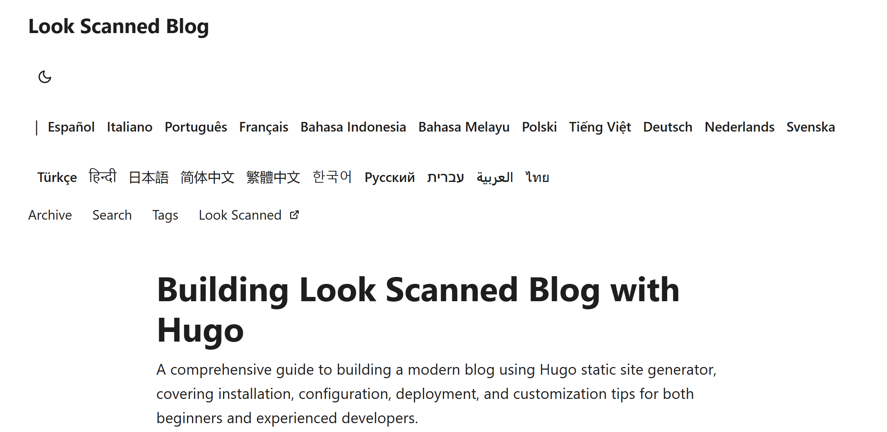
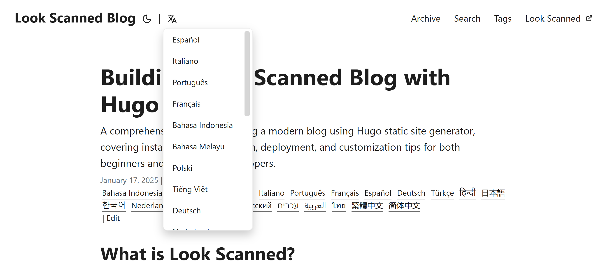

+++
date = '2025-01-17T21:11:58+08:00'
draft = false
title = 'Creare un elegante selettore di lingua a tendina per Hugo PaperMod'
summary = "Una guida pratica per implementare un selettore di lingua a tendina in Hugo PaperMod, rendendo più intuitiva la navigazione dei siti multilingua grazie a un'interfaccia elegante e ordinata"
description = "Una guida pratica per implementare un selettore di lingua a tendina in Hugo PaperMod, rendendo più intuitiva la navigazione dei siti multilingua grazie a un'interfaccia elegante e ordinata"
tags = ['hugo', 'papermod', 'tutorial', 'multilingua', 'html', 'i18n', 'css', 'sviluppo web', 'interfaccia']
+++

## Perché serve un nuovo selettore di lingua?

Il tema Hugo PaperMod offre di default un selettore di lingua che mostra tutte le lingue disponibili affiancate nell'intestazione. Questa soluzione è adeguata per i siti con poche lingue, ma per progetti come Look Scanned che gestiscono più di 20 lingue, l'intestazione diventa rapidamente caotica. Per risolvere questo problema, abbiamo sviluppato una versione più raffinata utilizzando un menu a tendina.



## Realizzazione

### Studio del codice di base

Il selettore di lingua originale si trova nel file `themes/PaperMod/layouts/partials/header.html`. Per personalizzarlo, creiamo una nostra versione in `layouts/partials/header.html`. Ecco il codice di partenza:

```html
{{- $lang := .Lang}} {{- $separator := or $label_text (not
site.Params.disableThemeToggle)}} {{- with site.Home.Translations }}
<ul class="lang-switch">
  {{- if $separator }}
  <li>|</li>
  {{ end }} {{- range . -}} {{- if ne $lang .Lang }}
  <li>
    <a
      href="{{- .Permalink -}}"
      title="{{ .Language.Params.languageAltTitle | default (.Language.LanguageName | emojify) | default (.Lang | title) }}"
      aria-label="{{ .Language.LanguageName | default (.Lang | title) }}"
    >
      {{- if (and site.Params.displayFullLangName (.Language.LanguageName)) }}
      {{- .Language.LanguageName | emojify -}} {{- else }} {{- .Lang | title -}}
      {{- end -}}
    </a>
  </li>
  {{- end -}} {{- end}}
</ul>
{{- end }}
```

### Creazione del menu a tendina

Per la nuova versione, utilizziamo un'icona dalla libreria ionicons5 che funge da pulsante e mostra, al passaggio del mouse, tutte le lingue disponibili in un elegante menu a tendina. Ecco il codice dettagliato:

```html
{{- $lang := .Lang }}
{{- $separator := or $label_text (not site.Params.disableThemeToggle)}}
{{- with site.Home.Translations }}
{{- if $separator }}<span class="nav-separator">|</span>{{ end }}
<div class="lang-select-dropdown">
    <!-- Pulsante del selettore lingua -->
    <button class="lang-select-dropdown-trigger" aria-label="{{- i18n "translations" | default "Translations" }}" type="button">
        <svg xmlns="http://www.w3.org/2000/svg" xmlns:xlink="http://www.w3.org/1999/xlink" viewBox="0 0 512 512" width="24" height="18"><path d="M478.33 433.6l-90-218a22 22 0 0 0-40.67 0l-90 218a22 22 0 1 0 40.67 16.79L316.66 406h102.67l18.33 44.39A22 22 0 0 0 458 464a22 22 0 0 0 20.32-30.4zM334.83 362L368 281.65L401.17 362z" fill="currentColor"></path><path d="M267.84 342.92a22 22 0 0 0-4.89-30.7c-.2-.15-15-11.13-36.49-34.73c39.65-53.68 62.11-114.75 71.27-143.49H330a22 22 0 0 0 0-44H214V70a22 22 0 0 0-44 0v20H54a22 22 0 0 0 0 44h197.25c-9.52 26.95-27.05 69.5-53.79 108.36c-31.41-41.68-43.08-68.65-43.17-68.87a22 22 0 0 0-40.58 17c.58 1.38 14.55 34.23 52.86 83.93c.92 1.19 1.83 2.35 2.74 3.51c-39.24 44.35-77.74 71.86-93.85 80.74a22 22 0 1 0 21.07 38.63c2.16-1.18 48.6-26.89 101.63-85.59c22.52 24.08 38 35.44 38.93 36.1a22 22 0 0 0 30.75-4.9z" fill="currentColor"></path></svg>
    </button>
    <!-- Menu delle lingue -->
    <div class="lang-select-dropdown-content">
        {{- range . -}}
        {{- if ne $lang .Lang }}
        <a lang="{{ .Lang }}" href="{{- .Permalink -}}" title="{{ .Language.Params.languageAltTitle | default (.Language.LanguageName | emojify) | default (.Lang | title) }}"
            aria-label="{{ .Language.LanguageName | default (.Lang | title) }}">
            {{- if (and site.Params.displayFullLangName (.Language.LanguageName)) }}
            {{- .Language.LanguageName | emojify -}}
            {{- else }}
            {{- .Lang | title -}}
            {{- end -}}
        </a>
        {{- end -}}
        {{- end}}
    </div>
</div>
{{- end }}
```

### Personalizzazione CSS

Per garantire un'esperienza utente fluida e raffinata, applichiamo questi stili CSS:

```css
.lang-select-dropdown {
  position: relative;
  display: inline-block;
}

.lang-select-dropdown-content {
  top: 50px;
  display: none;
  position: absolute;
  background-color: var(--entry);
  border-radius: var(--radius);
  border: 1px solid var(--border);
  box-shadow: 0px 8px 16px 0px rgba(0, 0, 0, 0.2);
  z-index: 1;
  max-height: calc(min(20em, 100vh - 100px));
  overflow-y: auto;
  overflow-x: hidden;
}

.lang-select-dropdown-content a {
  font-size: 14px;
  font-weight: inherit;
  line-height: 1;
  padding: 12px 16px;
  text-decoration: none;
  display: block;
  white-space: nowrap;
  transition: background-color 0.1s ease-in-out;
}

.lang-select-dropdown-content a:hover {
  background-color: #f1f1f1;
}

.lang-select-dropdown:hover .lang-select-dropdown-content {
  display: block;
}

.lang-select-dropdown-trigger {
  height: 100%;
  font-size: 26px;
  margin: auto 4px;
}

.nav-separator {
  margin: auto 4px;
}
```

Ed ecco il risultato finale. Passando il mouse sull'icona della lingua, si apre un elegante menu a tendina:



Il codice sorgente completo è disponibile nel nostro [repository GitHub](https://github.com/lookscanned/lookscanned-blog/commit/a47f5c2be887ab3ae198d1967f328d3683504ff0).

## Risorse utili

- [Documentazione ufficiale del tema PaperMod](https://adityatelange.github.io/hugo-PaperMod/posts/papermod/papermod-faq/#bundling-custom-css-with-themes-assets)
