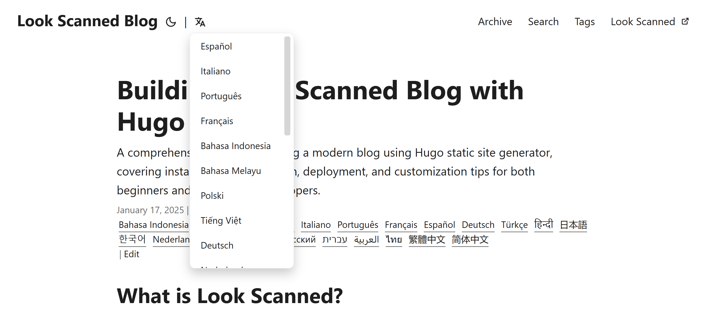

+++
date = '2025-01-17T21:11:58+08:00'
draft = false
title = 'Hugo PaperMod에서 세련된 언어 선택기 만들기'
summary = 'Hugo PaperMod 테마의 기본 언어 선택 기능을 드롭다운 방식으로 개선하여, 직관적인 아이콘과 세련된 메뉴로 다국어 사이트의 내비게이션 바를 깔끔하게 정리하는 방법을 소개합니다'
description = 'Hugo PaperMod 테마의 기본 언어 선택 기능을 드롭다운 방식으로 개선하여, 직관적인 아이콘과 세련된 메뉴로 다국어 사이트의 내비게이션 바를 깔끔하게 정리하는 방법을 소개합니다'
tags = ['hugo', 'papermod', '튜토리얼', '다국어지원', 'html', 'i18n', 'css']
+++

## 새로운 언어 선택기가 필요한 이유

Hugo PaperMod 테마는 기본적으로 언어 선택 기능을 제공하지만, 모든 지원 언어를 헤더에 나열하는 단순한 방식을 사용합니다. 지원하는 언어가 몇 개 없다면 이 방식도 괜찮지만, Look Scanned처럼 20개 이상의 언어를 지원하는 사이트에서는 헤더가 언어 옵션으로 복잡해지는 문제가 있습니다. 이를 해결하기 위해 드롭다운 방식의 세련된 언어 선택기를 만들어보았습니다.


## 구현 방법

### 기존 레이아웃 파악하기

PaperMod 테마의 언어 선택기는 `themes/PaperMod/layouts/partials/header.html` 파일에 구현되어 있습니다. 이를 수정하기 위해 `layouts/partials/header.html`에 새로운 코드를 작성합니다. 다음은 기존 코드입니다:

```html
{{- $lang := .Lang}} {{- $separator := or $label_text (not
site.Params.disableThemeToggle)}} {{- with site.Home.Translations }}
<ul class="lang-switch">
  {{- if $separator }}
  <li>|</li>
  {{ end }} {{- range . -}} {{- if ne $lang .Lang }}
  <li>
    <a
      href="{{- .Permalink -}}"
      title="{{ .Language.Params.languageAltTitle | default (.Language.LanguageName | emojify) | default (.Lang | title) }}"
      aria-label="{{ .Language.LanguageName | default (.Lang | title) }}"
    >
      {{- if (and site.Params.displayFullLangName (.Language.LanguageName)) }}
      {{- .Language.LanguageName | emojify -}} {{- else }} {{- .Lang | title -}}
      {{- end -}}
    </a>
  </li>
  {{- end -}} {{- end}}
</ul>
{{- end }}
```

### 드롭다운 메뉴 구현하기

새로운 디자인에서는 ionicons5의 언어 아이콘을 클릭 버튼으로 활용하고, 마우스를 올리면 지원 언어 목록이 표시되도록 구현했습니다. 구체적인 코드는 다음과 같습니다:

```html
{{- $lang := .Lang }}
{{- $separator := or $label_text (not site.Params.disableThemeToggle)}}
{{- with site.Home.Translations }}
{{- if $separator }}<span class="nav-separator">|</span>{{ end }}
<div class="lang-select-dropdown">
    <!-- 언어 선택 버튼 -->
    <button class="lang-select-dropdown-trigger" aria-label="{{- i18n "translations" | default "Translations" }}" type="button">
        <svg xmlns="http://www.w3.org/2000/svg" xmlns:xlink="http://www.w3.org/1999/xlink" viewBox="0 0 512 512" width="24" height="18"><path d="M478.33 433.6l-90-218a22 22 0 0 0-40.67 0l-90 218a22 22 0 1 0 40.67 16.79L316.66 406h102.67l18.33 44.39A22 22 0 0 0 458 464a22 22 0 0 0 20.32-30.4zM334.83 362L368 281.65L401.17 362z" fill="currentColor"></path><path d="M267.84 342.92a22 22 0 0 0-4.89-30.7c-.2-.15-15-11.13-36.49-34.73c39.65-53.68 62.11-114.75 71.27-143.49H330a22 22 0 0 0 0-44H214V70a22 22 0 0 0-44 0v20H54a22 22 0 0 0 0 44h197.25c-9.52 26.95-27.05 69.5-53.79 108.36c-31.41-41.68-43.08-68.65-43.17-68.87a22 22 0 0 0-40.58 17c.58 1.38 14.55 34.23 52.86 83.93c.92 1.19 1.83 2.35 2.74 3.51c-39.24 44.35-77.74 71.86-93.85 80.74a22 22 0 1 0 21.07 38.63c2.16-1.18 48.6-26.89 101.63-85.59c22.52 24.08 38 35.44 38.93 36.1a22 22 0 0 0 30.75-4.9z" fill="currentColor"></path></svg>
    </button>
    <!-- 드롭다운 메뉴 -->
    <div class="lang-select-dropdown-content">
        {{- range . -}}
        {{- if ne $lang .Lang }}
        <a lang="{{ .Lang }}" href="{{- .Permalink -}}" title="{{ .Language.Params.languageAltTitle | default (.Language.LanguageName | emojify) | default (.Lang | title) }}"
            aria-label="{{ .Language.LanguageName | default (.Lang | title) }}">
            {{- if (and site.Params.displayFullLangName (.Language.LanguageName)) }}
            {{- .Language.LanguageName | emojify -}}
            {{- else }}
            {{- .Lang | title -}}
            {{- end -}}
        </a>
        {{- end -}}
        {{- end}}
    </div>
</div>
{{- end }}
```

### 스타일 꾸미기

드롭다운 메뉴를 보기 좋고 자연스럽게 작동하도록 다음과 같은 CSS 스타일을 추가했습니다:

```css
.lang-select-dropdown {
  position: relative;
  display: inline-block;
}

.lang-select-dropdown-content {
  top: 50px;
  display: none;
  position: absolute;
  background-color: var(--entry);
  border-radius: var(--radius);
  border: 1px solid var(--border);
  box-shadow: 0px 8px 16px 0px rgba(0, 0, 0, 0.2);
  z-index: 1;
  max-height: calc(min(20em, 100vh - 100px));
  overflow-y: auto;
  overflow-x: hidden;
}

.lang-select-dropdown-content a {
  font-size: 14px;
  font-weight: inherit;
  line-height: 1;
  padding: 12px 16px;
  text-decoration: none;
  display: block;
  white-space: nowrap;
  transition: background-color 0.1s ease-in-out;
}

.lang-select-dropdown-content a:hover {
  background-color: #f1f1f1;
}

.lang-select-dropdown:hover .lang-select-dropdown-content {
  display: block;
}

.lang-select-dropdown-trigger {
  height: 100%;
  font-size: 26px;
  margin: auto 4px;
}

.nav-separator {
  margin: auto 4px;
}
```

완성된 모습은 다음과 같습니다. 언어 아이콘에 마우스를 올리면 깔끔한 드롭다운 메뉴가 나타납니다:



전체 코드는 [GitHub 저장소](https://github.com/lookscanned/lookscanned-blog/commit/a47f5c2be887ab3ae198d1967f328d3683504ff0)에서 확인하실 수 있습니다.

## 참고 자료

- [PaperMod 테마 사용 가이드](https://adityatelange.github.io/hugo-PaperMod/posts/papermod/papermod-faq/#bundling-custom-css-with-themes-assets)
