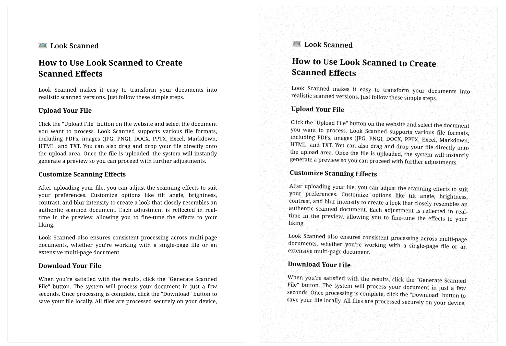

Soms moet ’n digitale dokument lyk asof dit geskandeer is. Of dit nou is om ’n professionele aanslag te gee, aan spesifieke vereistes te voldoen, of bloot vir estetiese doeleindes—om ’n dokument skandeer-agtig te laat lyk, is verbasend eenvoudig. In hierdie blogplasing neem ons jou stap vir stap deur die proses.

## Waarom ’n dokument soos geskandeer laat lyk?

Voordat ons by die **hoe** uitkom, kyk eers **waarom** jy hierdie effek dalk nodig het:

- **Voeg egtheid by**: Geskandeerde dokumente lyk dikwels meer geloofwaardig, veral vir ooreenkomste of vorms.
- **Voldoen aan indieningsvereistes**: Sommige organisasies vereis dokumente wat lyk asof dit fisies onderteken en toe geskandeer is.
- **Verhoog sekuriteit**: ’n Skandeer-effek maak redigering moeiliker en voeg ’n ekstra beskermingslaag by.
- **Verbeter estetika**: Die tekstuur van ’n skandeer-effek gee ’n gepoleerde, tasbare gevoel.

## Nutsgoed wat jy kan gebruik

Om ’n skandeer-effek te skep verg nie komplekse sagteware nie. Hier is ’n paar opsies:

- **[Look Scanned](https://lookscanned.io)**: ’n Gebruikervriendelike, blaaiergebaseerde hulpmiddel wat PDF’s, beelde, DOCX, PPTX, Excel-lêers, Markdown, HTML en TXT in skandeer-styl dokumente omskep.
- **Foto-redigeer sagteware**: Programme soos Photoshop of GIMP kan soortgelyke filters toepas, maar verg gewoonlik meer tyd en kundigheid.
- **Druk en skandeer**: As jy toegang tot ’n drukker en ’n skandeerder het, kan jy die dokument druk en weer inskandeer vir die skandeer-voorkoms.

In hierdie tutoriaal fokus ons op **[Look Scanned](https://lookscanned.io)**, aangesien dit vinnig, intuïtief en gratis is.

## Stap-vir-stap gids met Look Scanned

Volg hierdie stappe om die skandeer-effek te kry:

### Besoek Look Scanned

Maak jou blaaier oop en gaan na [lookscanned.io](https://lookscanned.io/scan). Look Scanned is ’n veelsydige webtoepassing wat alle groot mobiele en rekenaarblaaiers ondersteun, sodat jy dit gerieflik op jou foon, tablet of rekenaar kan gebruik. Die toepassing is ook **vanlyn-bekwaam**—sodra jy die webwerf die eerste keer besoek het, kan jy dit verder gebruik selfs sonder internet.

### Laai jou lêer op

Sleep-en-los jou lêer in die aangewese oplaai-gebied, of klik om dit handmatig vanaf jou toestel te kies. Look Scanned ondersteun ’n wye reeks formate, insluitend:

- PDF-dokumente
- Beelde (JPG, PNG, ens.)
- Microsoft Office-lêers (DOCX, PPTX, Excel)
- Webformate (HTML, Markdown)
- Suiwer teks (TXT)

### Pas instellings aan

Verfyn die instellings om ’n realistiese skandeer-voorkoms te skep:

- **Kleurruimte (Colorspace)**: Kies gryskleur (grayscale) of kleur.
- **Rand (Border)**: Voeg rande by of pas dit aan vir ’n “scanned edge”-voorkoms.
- **Rotasie en rotasievariasie**: Kantel die dokument liggies om skandeerder-onvolmaakthede na te boots.
- **Helderheid en kontras**: Fyninstel vir gebalanseerde leesbaarheid.
- **Vervaag (Blur)**: Pas ’n subtiele vervaag toe om skandeerder-beperkings te emuleer.
- **Ruis (Noise)**: Voeg ’n papieragtige tekstuur vir outentisiteit by.
- **Geelagtige tint**: Simuleer verouderde of effens verbleikte papier.
- **Resolusie**: Pas aan vir die gevoel van ’n egte geskandeerde dokument.
- **Watermerk**: Voeg watermerke by vir beskerming of handelsmerkdoeleindes.
- **PDF-metadata**: Wysig metadata vir verdere personalisering.

### Voorskou jou dokument

Gebruik die voorskou in reële tyd om seker te maak die uitvoer voldoen aan jou verwagtinge.

### Laai die geskandeerde lêer af

Sodra jy tevrede is, klik die aflaaiknoppie om die omgeskakelde dokument te stoor.

## Wenke vir ’n realistiese voorkoms

- **Matige aanpassings**: Moenie vervaag of tekstuur oormatig gebruik nie—hou dit natuurlik.
- **Eksperimenteer met hoeke**: Klein rotasies laat die dokument dikwels meer outentiek lyk.

## Gevolgtrekking

Met hulpmiddels soos Look Scanned was dit nog nooit makliker om dokumente soos geskandeerde kopieë te laat lyk nie. Of jy nou ’n indiening voorberei, ’n kontrak deel, of met ontwerp eksperimenteer—’n outentieke skandeer-voorkoms is net ’n paar klikke weg.
