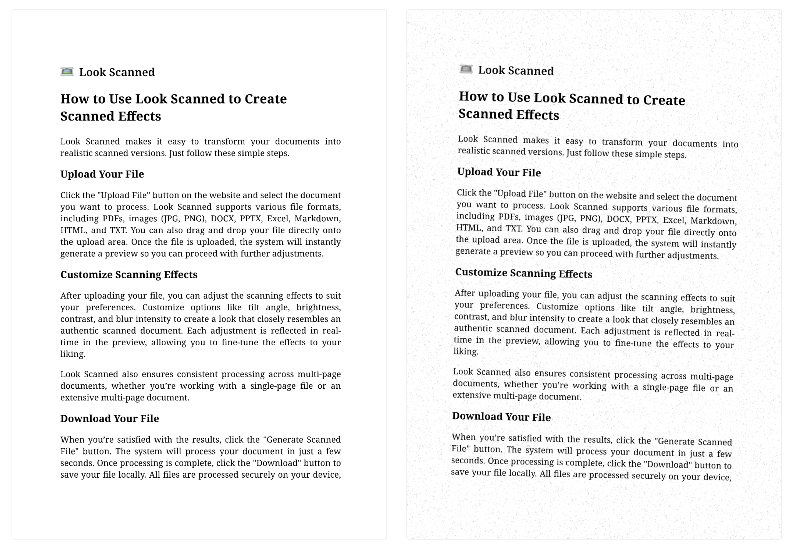

+++
date = '2025-01-20T09:35:50+08:00'
draft = false
title = 'Πώς να μετατρέψετε ψηφιακά αρχεία (PDF, DOCX, εικόνες) σε ρεαλιστικά σαρωμένα αντίγραφα'
tags = ['pdf', 'εργαλεία', 'οδηγός', 'επεξεργασία εγγράφων', 'σάρωση', 'βήμα προς βήμα']
summary = 'Μάθετε πώς να δώσετε στα ψηφιακά σας έγγραφα την όψη πραγματικά σαρωμένων αντιγράφων με το Look Scanned, ένα δωρεάν εργαλείο που λειτουργεί στο πρόγραμμα περιήγησης. Ο οδηγός καλύπτει τα βήματα, τις διαθέσιμες ρυθμίσεις και πρακτικές συμβουλές για ένα πειστικό αποτέλεσμα.'
description = 'Μάθετε πώς να δώσετε στα ψηφιακά σας έγγραφα την όψη πραγματικά σαρωμένων αντιγράφων με το Look Scanned, ένα δωρεάν εργαλείο που λειτουργεί στο πρόγραμμα περιήγησης. Ο οδηγός καλύπτει τα βήματα, τις διαθέσιμες ρυθμίσεις και πρακτικές συμβουλές για ένα πειστικό αποτέλεσμα.'
+++

Μερικές φορές χρειάζεται ένα ψηφιακό έγγραφο να δείχνει σαν να έχει περάσει από σαρωτή. Είτε θέλετε να του δώσετε πιο επαγγελματική εμφάνιση, είτε πρέπει να καλύψετε συγκεκριμένες απαιτήσεις υποβολής, είτε απλώς επιδιώκετε ένα πιο φυσικό αισθητικό αποτέλεσμα, η μετατροπή του σε «σαρωμένο» αντίγραφο είναι πολύ πιο απλή απ' όσο φαίνεται. Σε αυτό το άρθρο θα δούμε τη διαδικασία βήμα προς βήμα.

## Γιατί να κάνετε ένα έγγραφο να φαίνεται σαρωμένο;

Πριν περάσουμε στο πρακτικό μέρος, ας δούμε γιατί αυτό το εφέ είναι χρήσιμο:

- **Προσθέτει αξιοπιστία**: Τα σαρωμένα έγγραφα συχνά φαίνονται πιο επίσημα και πιο πειστικά, ειδικά σε συμφωνητικά ή φόρμες.
- **Καλύπτει απαιτήσεις υποβολής**: Ορισμένοι οργανισμοί ζητούν έγγραφα που να μοιάζουν υπογεγραμμένα και σαρωμένα.
- **Δυσκολεύει την επεξεργασία**: Το εφέ σάρωσης κάνει το περιεχόμενο πιο δύσκολο να τροποποιηθεί, προσθέτοντας ένα επιπλέον επίπεδο προστασίας.
- **Βελτιώνει την αισθητική**: Η υφή και οι μικρές ατέλειες ενός σαρωμένου εγγράφου δίνουν πιο φυσική και ολοκληρωμένη εικόνα.

## Εργαλεία που μπορείτε να χρησιμοποιήσετε

Δεν χρειάζεστε περίπλοκο λογισμικό για να πετύχετε αυτό το αποτέλεσμα. Αυτές είναι οι βασικές επιλογές:

- **[Look Scanned](https://lookscanned.io)**: Ένα εύχρηστο εργαλείο που λειτουργεί στο πρόγραμμα περιήγησης και μετατρέπει PDF, εικόνες, DOCX, PPTX, αρχεία Excel, Markdown, HTML και TXT σε έγγραφα με ρεαλιστική όψη σαρωμένου αντιγράφου.
- **Λογισμικό επεξεργασίας εικόνας**: Εφαρμογές όπως το Photoshop ή το GIMP μπορούν να προσομοιώσουν εφέ σάρωσης, αλλά συνήθως απαιτούν περισσότερο χρόνο και τεχνική εξοικείωση.
- **Εκτύπωση και επανασάρωση**: Αν έχετε πρόσβαση σε εκτυπωτή και σαρωτή, μπορείτε να εκτυπώσετε το έγγραφο και να το σαρώσετε ξανά για να πετύχετε αυθεντικό αποτέλεσμα.

Σε αυτόν τον οδηγό θα επικεντρωθούμε στο **[Look Scanned](https://lookscanned.io)**, επειδή είναι γρήγορο, εύχρηστο και δωρεάν.

## Οδηγός βήμα προς βήμα με το Look Scanned

Ακολουθήστε τα παρακάτω βήματα για να δώσετε στο αρχείο σας την όψη σαρωμένου εγγράφου:

### Επισκεφθείτε το Look Scanned

Ανοίξτε το πρόγραμμα περιήγησής σας και μεταβείτε στο [lookscanned.io](https://lookscanned.io/scan). Το Look Scanned είναι μια ευέλικτη διαδικτυακή εφαρμογή που λειτουργεί σε όλα τα βασικά προγράμματα περιήγησης σε υπολογιστή, tablet και κινητό. Υποστηρίζει επίσης χρήση εκτός σύνδεσης: αφού επισκεφθείτε τον ιστότοπο μία φορά, μπορείτε να συνεχίσετε να το χρησιμοποιείτε ακόμη και χωρίς πρόσβαση στο διαδίκτυο.

### Ανεβάστε το αρχείο σας

Σύρετε και αφήστε το αρχείο σας στην ειδική περιοχή μεταφόρτωσης ή κάντε κλικ για να το επιλέξετε χειροκίνητα από τη συσκευή σας. Το Look Scanned υποστηρίζει πολλούς τύπους αρχείων, όπως:

- Έγγραφα PDF
- Εικόνες (JPG, PNG κ.ά.)
- Αρχεία Microsoft Office (DOCX, PPTX, Excel)
- Μορφές web (HTML, Markdown)
- Απλό κείμενο (TXT)

### Προσαρμόστε τις ρυθμίσεις

Ρυθμίστε τις επιλογές ώστε το αποτέλεσμα να θυμίζει όσο το δυνατόν περισσότερο πραγματική σάρωση:

- **Χρωματικός χώρος**: Επιλέξτε αποχρώσεις του γκρι ή έγχρωμη έξοδο.
- **Περίγραμμα**: Προσθέστε ή τροποποιήστε περιγράμματα για πιο αυθεντική σαρωμένη όψη.
- **Περιστροφή και διακύμανση γωνίας**: Δώστε μια ελαφριά κλίση για να προσομοιώσετε τις μικρές ατέλειες ενός σαρωτή.
- **Φωτεινότητα και αντίθεση**: Ρυθμίστε προσεκτικά τις τιμές για πιο ισορροπημένο αποτέλεσμα.
- **Θόλωση**: Εφαρμόστε μια ελαφριά θόλωση ώστε να προσομοιώσετε τους περιορισμούς ενός σαρωτή.
- **Θόρυβος**: Προσθέστε υφή σαν χαρτί για μεγαλύτερη αληθοφάνεια.
- **Κιτρινωπή απόχρωση**: Προσομοιώστε παλιό ή ελαφρώς φθαρμένο χαρτί.
- **Ανάλυση**: Προσαρμόστε την ανάλυση ώστε το αρχείο να δίνει την αίσθηση γνήσιου σαρωμένου εγγράφου.
- **Υδατογράφημα**: Προσθέστε υδατογράφημα στο έγγραφό σας.
- **Μεταδεδομένα PDF**: Επεξεργαστείτε τα μεταδεδομένα για πιο εξατομικευμένο αποτέλεσμα.

### Προεπισκόπηση του εγγράφου

Χρησιμοποιήστε την προεπισκόπηση σε πραγματικό χρόνο για να βεβαιωθείτε ότι το αποτέλεσμα ανταποκρίνεται στις προσδοκίες σας.

### Κατεβάστε το σαρωμένο αρχείο

Μόλις μείνετε ικανοποιημένοι από το αποτέλεσμα, πατήστε το κουμπί λήψης για να αποθηκεύσετε το επεξεργασμένο έγγραφο.

## Συμβουλές για πιο ρεαλιστικό αποτέλεσμα

- **Μην υπερβάλλετε με τις ρυθμίσεις**: Η υπερβολική θόλωση ή η υπερβολική υφή μπορεί να κάνουν το αποτέλεσμα να φαίνεται τεχνητό.
- **Πειραματιστείτε με μικρές περιστροφές**: Μια ελαφριά κλίση αρκεί συχνά για να κάνει το έγγραφο να δείχνει πιο αυθεντικό.

## Συμπέρασμα

Το να κάνετε ένα έγγραφο να μοιάζει σαρωμένο είναι πλέον πολύ εύκολο χάρη σε εργαλεία όπως το Look Scanned. Είτε ετοιμάζετε ένα αρχείο για υποβολή, είτε μοιράζεστε ένα συμβόλαιο, είτε θέλετε απλώς ένα πιο ρεαλιστικό οπτικό αποτέλεσμα, μπορείτε να το πετύχετε μέσα σε λίγα μόνο κλικ.
