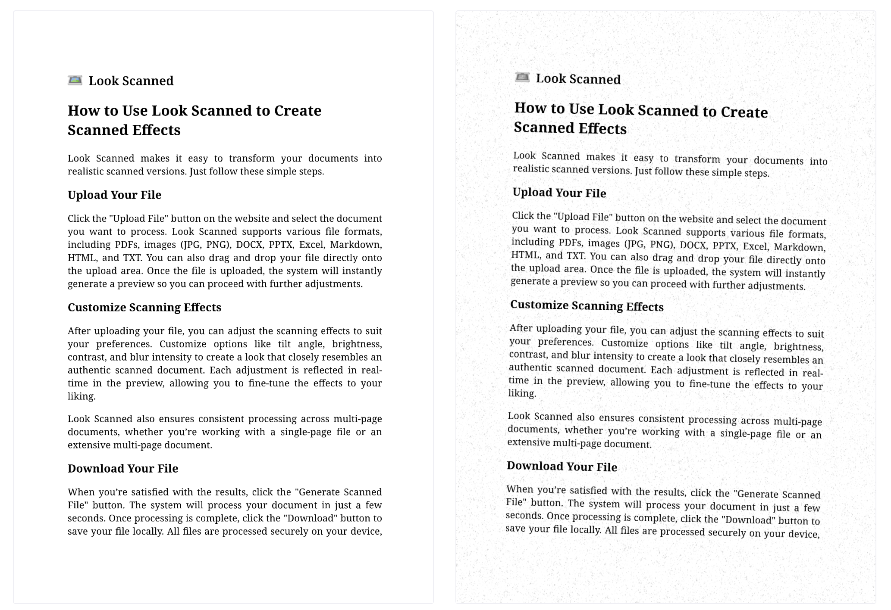

+++
date = '2025-01-20T09:35:50+08:00'
draft = false
title = 'Hoe u uw digitale bestanden (PDF, DOCX, afbeeldingen) kunt omzetten naar realistische gescande documenten'
tags = ['pdf', 'tools', 'tutorial', 'documentverwerking', 'scannen', 'handleiding']
summary = 'Leer hoe u uw digitale documenten er uit kunt laten zien als gescande documenten met Look Scanned, een gratis browsergebaseerde tool. Deze handleiding bevat stap-voor-stap instructies, aanpassingsopties en tips voor het bereiken van een authentieke gescande look.'
description = 'Leer hoe u uw digitale documenten er uit kunt laten zien als gescande documenten met Look Scanned, een gratis browsergebaseerde tool. Deze handleiding bevat stap-voor-stap instructies, aanpassingsopties en tips voor het bereiken van een authentieke gescande look.'
+++

Soms wilt u dat uw digitale documenten eruitzien alsof ze gescand zijn. Of het nu gaat om een professionelere uitstraling, het voldoen aan bepaalde vereisten, of om esthetische redenen - een document er gescand uit laten zien is eenvoudiger dan u denkt. In dit artikel nemen we u stap voor stap mee door het proces.

## Waarom zou u een document er gescand uit willen laten zien?

Voordat we de methode bespreken, bekijken we eerst waarom dit effect nuttig kan zijn:

- **Geloofwaardigheid**: Gescande documenten komen betrouwbaarder over, vooral bij contracten en officiële formulieren.
- **Voldoen aan vereisten**: Sommige instanties vragen specifiek om documenten die handgetekend en gescand lijken.
- **Extra beveiliging**: Het scan-effect maakt het lastiger om het document te wijzigen, wat een extra beveiligingslaag biedt.
- **Professionele uitstraling**: De kenmerkende textuur van gescande documenten geeft een professionele en authentieke indruk.

## Beschikbare tools

Voor het maken van een scan-effect heeft u geen ingewikkelde programma's nodig. Dit zijn de belangrijkste opties:

- **Look Scanned**: Een gebruiksvriendelijke online tool die PDF's, afbeeldingen, DOCX, PPTX, Excel, Markdown, HTML en TXT-bestanden omzet naar natuurgetrouwe gescande documenten.
- **Beeldbewerkingsprogramma's**: Programma's zoals Photoshop of GIMP kunnen scan-effecten toevoegen, maar hiervoor is wel technische kennis vereist.
- **Fysiek scannen**: Beschikt u over een printer en scanner, dan kunt u het document ook gewoon afdrukken en scannen.

In deze handleiding richten we ons op **Look Scanned** vanwege het gebruiksgemak, de snelheid en het feit dat het gratis is.

## Stap-voor-stap handleiding voor Look Scanned

Volg deze stappen om een scan-effect te creëren:

### Toegang tot Look Scanned

Open uw browser en ga naar [lookscanned.io](https://lookscanned.io). Look Scanned is een veelzijdige webapplicatie die werkt op alle belangrijke mobiele en desktop browsers, waardoor u het gemakkelijk kunt gebruiken op uw smartphone, tablet of computer. De applicatie werkt ook offline - na uw eerste bezoek aan de site kunt u het gebruiken zonder internetverbinding.

### Bestand uploaden

Sleep een bestand naar het uploadgebied of klik om handmatig een bestand van uw apparaat te kiezen. Look Scanned ondersteunt verschillende bestandsformaten:

- PDF-documenten
- Afbeeldingen (JPG, PNG etc.)
- Microsoft Office-bestanden (DOCX, PPTX, Excel)
- Webformaten (HTML, Markdown)
- Tekstbestanden (TXT)

### Instellingen aanpassen

Pas deze instellingen aan voor een realistisch scan-effect:

- **Kleurmodus**: Kies tussen zwart-wit of kleur
- **Marges**: Stel de randen in voor een authentieke scan-look
- **Rotatie**: Voeg een lichte scheefstand toe om scanner-onvolkomenheden na te bootsen
- **Helderheid en contrast**: Stel bij voor een natuurlijke uitstraling
- **Vervaging**: Voeg subtiele vervaging toe om scanner-eigenschappen na te bootsen
- **Papiertextuur**: Voeg papierstructuur toe voor meer authenticiteit
- **Vergeling**: Voeg een verouderingseffect toe
- **Resolutie**: Stel in voor een realistische scan-kwaliteit
- **Watermerk**: Voeg desgewenst een watermerk toe
- **PDF-eigenschappen**: Pas de documentgegevens aan

### Voorbeeld bekijken

Gebruik de realtime voorbeeldweergave om te controleren of het resultaat aan uw verwachtingen voldoet.

### Verwerkt bestand downloaden

Wanneer u tevreden bent met het resultaat, klikt u op de downloadknop om het geconverteerde document op te slaan.

## Tips voor het beste resultaat

- **Gebruik effecten met mate**: Overdrijf niet met vervaging of textuur om de geloofwaardigheid te waarborgen.
- **Subtiele scheefstand**: Een lichte kanteling maakt het document natuurgetrouwer.

## Conclusie

Met tools zoals Look Scanned is het tegenwoordig eenvoudiger dan ooit om documenten er gescand uit te laten zien. Of u nu zakelijke documenten voorbereidt, contracten deelt, of met vormgeving experimenteert, met enkele muisklikken creëert u een professioneel ogende scan.
