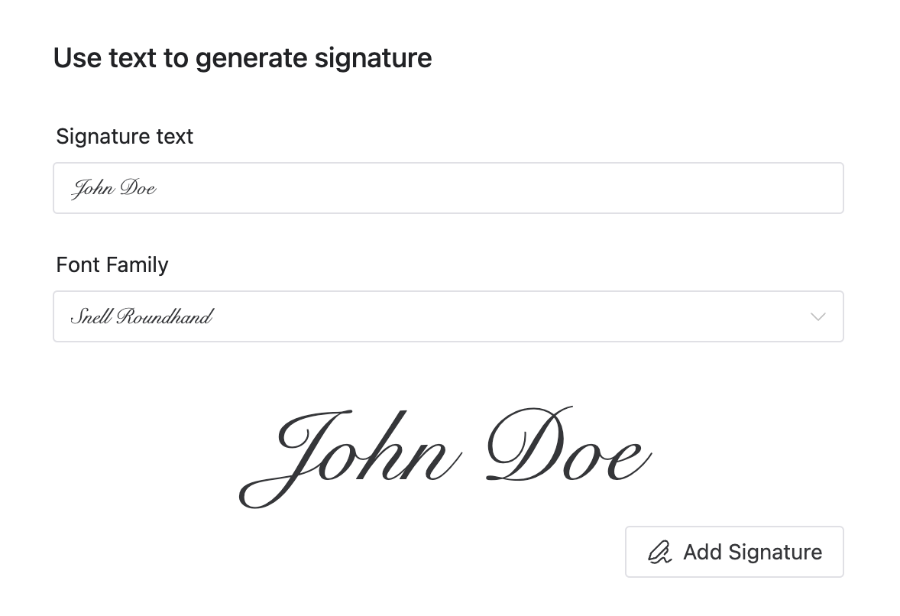
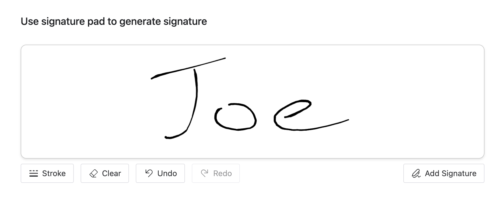
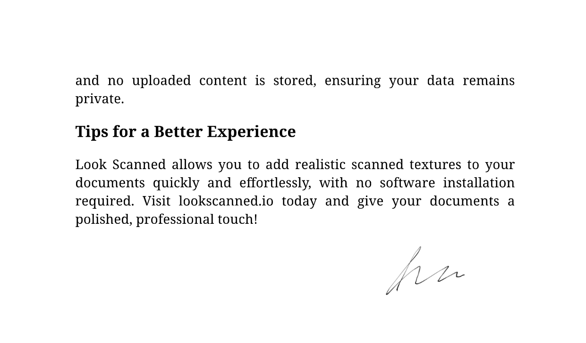

Look Scanned-এর স্রষ্টা হিসেবে, আমার লক্ষ্য সবসময় নথি প্রক্রিয়াকরণকে আরো দ্রুত, সহজ এবং পেশাদার করা। আমি একটি নতুন বৈশিষ্ট্য ঘোষণা করতে উত্সাহিত—স্বাক্ষর এবং স্ট্যাম্প সেটিংস—যা আপনাকে অনায়াসে আপনার স্ক্যান করা নথিগুলিতে পেশাদার-গ্রেড স্বাক্ষর এবং স্ট্যাম্প যোগ করতে দেয়, আপনার কর্মপ্রবাহকে সুবিন্যস্ত করে এবং নথির বিশ্বাসযোগ্যতা বাড়ায়।

## স্বাক্ষর এবং স্ট্যাম্প কেন যোগ করবেন?

স্বাক্ষর এবং স্ট্যাম্প সরকারি নথিগুলিতে অনুমোদন, কর্তৃত্ব এবং আনুষ্ঠানিকতা নির্দেশ করে। ঐতিহ্যগতভাবে, এই উপাদানগুলি যোগ করতে নথিগুলি মুদ্রণ, শারীরিকভাবে স্বাক্ষর বা স্ট্যাম্প করা এবং তারপর আবার স্ক্যান করার প্রয়োজন ছিল—একটি জটিল, সময়সাপেক্ষ প্রক্রিয়া। Look Scanned এটিকে উল্লেখযোগ্যভাবে সরল করে।

কল্পনা করুন আপনার একটি চুক্তিতে কোম্পানির স্ট্যাম্প যোগ করতে হবে। পুরানো পদ্ধতির পরিবর্তে, এখন আপনি কেবল আপনার PDF Look Scanned-এ আপলোড করতে পারেন, আপনার পছন্দসই স্ট্যাম্প স্টাইল বেছে নিতে পারেন, এর আকার এবং অবস্থান সামঞ্জস্য করতে পারেন, তাৎক্ষণিকভাবে পরিবর্তনগুলি প্রিভিউ করতে পারেন এবং আপনার সম্পূর্ণ নথি ডাউনলোড করতে পারেন—সবকিছু এক মিনিটেরও কম সময়ে।

## স্বাক্ষর এবং স্ট্যাম্প তৈরির তিনটি নমনীয় উপায়

Look Scanned বিভিন্ন ব্যবহারকারীর পছন্দ মেটাতে তিনটি সুবিধাজনক পদ্ধতি অফার করে:

- **একটি ছবি আপলোড করুন**: দ্রুত একটি বিদ্যমান স্বাক্ষর বা স্ট্যাম্প ছবি আপলোড করুন, যা ইতিমধ্যে পেশাদারভাবে প্রস্তুতকৃত ফাইল আছে এমন ব্যবহারকারীদের জন্য উপযুক্ত।
- **টেক্সট-তৈরি স্বাক্ষর**: কেবল আপনার নাম টাইপ করুন, এবং Look Scanned স্বয়ংক্রিয়ভাবে কাস্টমাইজেবল ফন্ট এবং স্টাইল সহ একটি ব্যক্তিগত স্বাক্ষর তৈরি করবে।

- **স্বাক্ষর প্যাড**: আপনার ডিভাইসে আপনার স্বাক্ষর ম্যানুয়ালি আঁকুন, আপনার প্রাকৃতিক হস্তাক্ষর ক্যাপচার করে এবং একটি সত্যিকারের, ব্যক্তিগত স্পর্শ প্রদান করে।

## রিয়েল-টাইম প্রিভিউ দিয়ে অবস্থান এবং স্টাইল কাস্টমাইজ করুন

সহজেই আপনার স্বাক্ষর এবং স্ট্যাম্পের আকার, অবস্থান এবং স্টাইল সামঞ্জস্য করুন। প্রতিটি সামঞ্জস্য তৎক্ষণাৎ দৃশ্যমান, যা আপনাকে একটি নিরবচ্ছিন্ন "যা দেখেন তাই পাবেন" অভিজ্ঞতা দেয়, নিশ্চিত করে যে আপনার নথিগুলি সর্বদা সেরা দেখায়।

## গোপনীয়তা প্রথম—সর্বদা

আপনার গোপনীয়তা সর্বোচ্চ। Look Scanned-এর সমস্ত প্রক্রিয়াকরণের মতো, স্বাক্ষর এবং স্ট্যাম্প সম্পূর্ণভাবে আপনার ব্রাউজারের মধ্যে তৈরি এবং পরিচালিত হয়। আপনার ডেটা কখনো আপনার ডিভাইস ছেড়ে যায় না, নিশ্চিত করে যে আপনার সংবেদনশীল তথ্য সম্পূর্ণ নিরাপদ থাকে।

এখানে নতুন স্বাক্ষর এবং স্ট্যাম্প বৈশিষ্ট্য প্রদর্শনকারী একটি উদাহরণ:

আপনার নথিগুলিকে একটি পেশাদার ধার দিতে প্রস্তুত? আজই [Look Scanned](https://lookscanned.io) পরিদর্শন করুন এবং আমাদের নতুন স্বাক্ষর এবং স্ট্যাম্প বৈশিষ্ট্য প্রথমহাতে অনুভব করুন!