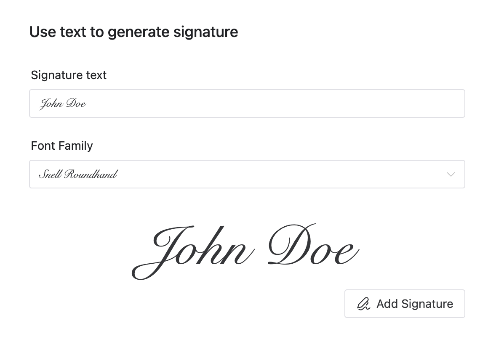

A Look Scanned létrehozójaként célom mindig az volt, hogy a dokumentumfeldolgozást gyorsabbá, egyszerűbbé és professzionálisabbá tegyem. Izgatottan jelentem be az új funkciót—az aláírás és bélyegző beállításokat—amely lehetővé teszi, hogy könnyedén professzionális minőségű aláírásokat és bélyegzőket adjon a beszkennelt dokumentumaihoz, egyszerűsítve a munkafolyamatot és növelve a dokumentumok hitelességét.

## Miért adjunk hozzá aláírásokat és bélyegzőket?

Az aláírások és bélyegzők jóváhagyást, tekintélyt és formálisságot jeleznek a hivatalos dokumentumokban. Hagyományosan ezen elemek hozzáadása megkövetelte a dokumentumok kinyomtatását, fizikai aláírását vagy lebélyegzését, majd visszaszkennelését—egy körülményes, időigényes folyamat. A Look Scanned ezt jelentősen leegyszerűsíti.

Képzelje el, hogy hozzá kell adnia egy céges bélyegzőt egy szerződéshez. A régi módszer helyett most egyszerűen feltöltheti PDF-jét a Look Scannedbe, kiválaszthatja a kívánt bélyegző stílust, beállíthatja méretét és pozícióját, azonnal előnézheti a változásokat, és letöltheti kész dokumentumát—mindezt egy perc alatt.

## Három rugalmas módszer aláírások és bélyegzők létrehozására

A Look Scanned három kényelmes módszert kínál a különböző felhasználói igények kielégítésére:

- **Kép feltöltése**: Gyorsan töltse fel egy meglévő aláírás vagy bélyegző képet, tökéletes azoknak a felhasználóknak, akiknek már vannak professzionálisan előkészített fájljaik.
- **Szövegből generált aláírások**: Egyszerűen írja be a nevét, és a Look Scanned automatikusan létrehoz egy személyre szabott aláírást testreszabható betűtípusokkal és stílusokkal.

- **Aláírástábla**: Kézzel rajzolja meg aláírását eszközén, rögzítse természetes kézírását és biztosítson autentikus, személyes hatást.

## Testre szabás pozíció és stílus valós idejű előnézetekkel

Könnyen állítsa be aláírásainak és bélyegzőinek méretét, pozícióját és stílusát. Minden módosítás azonnal látható, zökkenőmentes "amit lát, azt kapja" élményt nyújtva, biztosítva, hogy dokumentumai mindig a legjobban nézzenek ki.

## Adatvédelem első—mindig

Az adatvédelem a legfontosabb. Mint minden feldolgozás a Look Scannedben, az aláírások és bélyegzők teljesen a böngészőjében jönnek létre és kerülnek kezelésre. Adatai soha nem hagyják el az eszközét, biztosítva, hogy érzékeny információi teljesen biztonságban maradjanak.

Itt van egy példa, amely bemutatja az új aláírás és bélyegző funkciót:

Készen áll arra, hogy professzionális hatást adjon dokumentumainak? Látogassa meg még ma a [Look Scanned](https://lookscanned.io) oldalt és tapasztalja meg új aláírás és bélyegző funkciónkat első kézből!